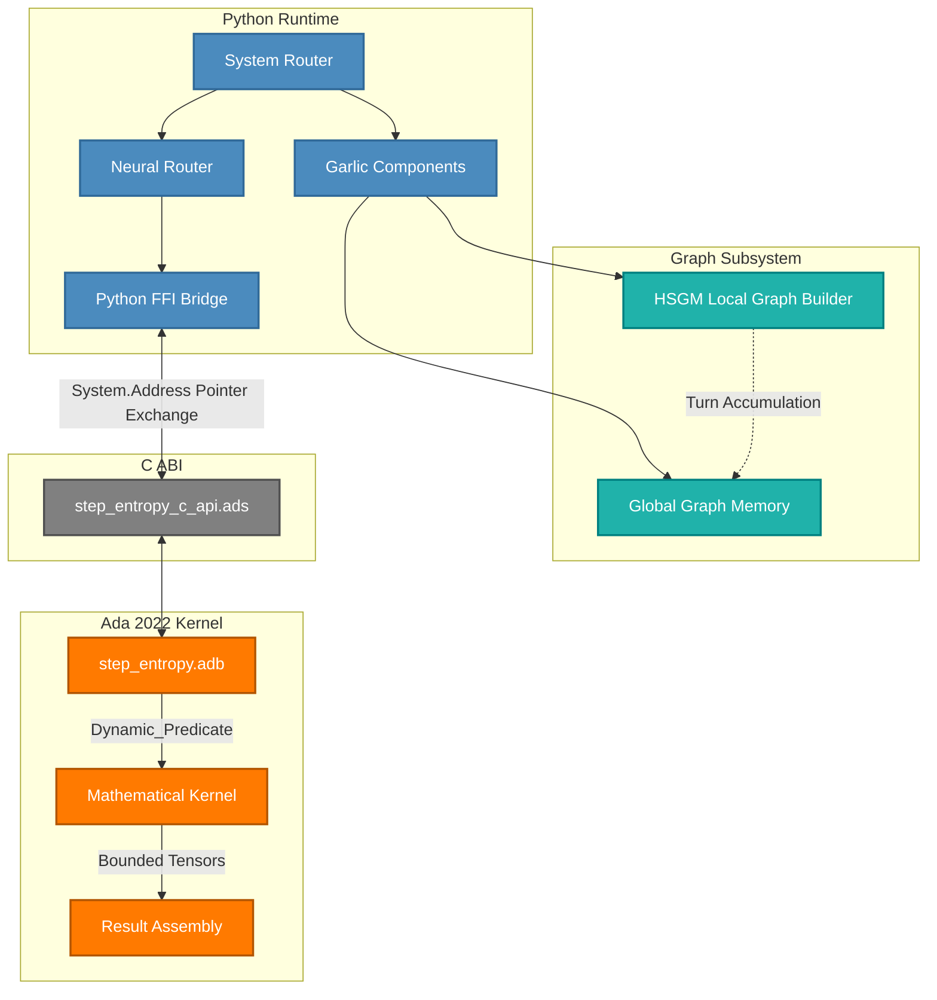
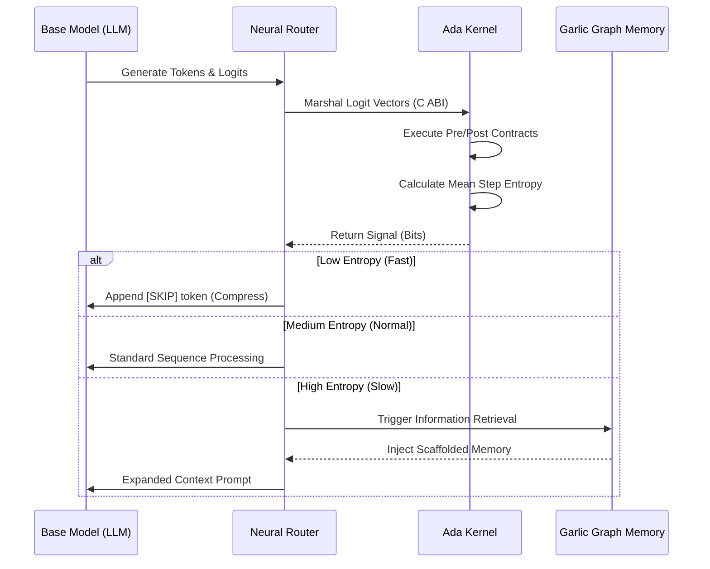

# ADA-Step-Entropy: Kernel Integration & System Router Architecture

**CLASSIFICATION:** UNCLASSIFIED // FOUO
**STATUS:** ACTIVE // Ada kernel + System Router core verified end-to-end (2026-09-22); LoRA-MoE stack and RLHF training pipeline are separate, less-hardened layers — see PLAN.md
**DATE:** 2026-04-26 (last re-verified 2026-09-22)

[]()
[](LICENSE)
[]()
[]()
[]()

---

## 1. Executive Summary

**ADA-Step-Entropy** represents a state-of-the-art (SOTA++) integration of the theoretical "Step Entropy" reasoning compression architecture (`arXiv:2508.03346`). This project eschews traditional, purely Python-based statistical implementations in favor of a mathematically rigorous, mathematically bound **Ada 2022 sovereign kernel**.

By compiling numerical models into Ada, the system benefits from uncompromising contractual guarantees (`Pre`, `Post`, `Dynamic_Predicate`), auditable numerical stability, and verifiable correctness. It acts as the core mathematical engine for Daeron's LLM orchestration stack (**Garlic**) and provides dynamic prompt-routing through its associated **System-Router**.

This repository is designed for full autonomous interoperability with AI agents (including Google Jules), featuring executable invariants and zero-overhead C-ABI bridging to PyTorch/NumPy runtimes.

---

## 2. Table of Contents

1. [Executive Summary](#1-executive-summary)
2. [Technical Specifications](#3-technical-specifications)
3. [System Architecture](#4-system-architecture)
4. [Process Flows](#5-process-flows)
5. [Implementation Notes](#6-implementation-notes)
6. [Agent Configuration (Google Jules)](#7-agent-configuration)
7. [Technical Appendices](#8-technical-appendices)

---

## 3. Technical Specifications

### 3.1 Kernel Parameters

- **Core Language:** Ada 2022 (GNAT Pro 13.3.0)
- **Mathematical Contracts:** Bounded array structures (`Max_Vocab_Size = 262,144`, `Max_Tokens_Per_Step = 512`)
- **Numerical Stability:** Hardware-bound FP operations with log computation epsilon `1.0e-10`
- **Output Artifacts:** `libgarlic_core.so` linking dynamically to `libgnat-13.so`

### 3.2 Bridging Subsystem

- **FFI Layer:** Python `ctypes` bindings targeting exported C ABI (15 single-underscore symbols in `libgarlic_core.so`, declared in `step_entropy_c_api.ads`)
- **Runtime Target:** Python 3.14.4 in isolated virtual environment (`.venv`)
- **Tensor Ops Integration:** NumPy / PyTorch 2.14.0+cu130 / transformers 5.17.0

### 3.3 Theoretical Grounding (arXiv:2508.03346)

The mathematical correctness adheres to the canonical paper metrics:

1. **Token Entropy:** $$H(t) = -\sum_{w \in V} p(w|ctx) \log_2 p(w|ctx)$$
2. **Mean Step Entropy:** $$H(S_i) = \frac{1}{M_i} \sum_{j} H(t_{i,j})$$
   *Operational Override:* Routing explicitly relies on the **average** token entropy per step for uniform thresholding, rejecting the paper's raw summation to prevent length-based bias.

---

## 4. System Architecture

The overarching system utilizes a triad of distinct execution boundaries: The orchestration plane (Python), the FFI bridging plane (C ABI), and the mathematical constraint plane (Ada 2022).



---

## 5. Process Flows

### 5.1 Entropy-Based Signal Routing

The central insight of the Step Entropy architecture revolves around using Mean Step Entropy as a deterministic indicator of reasoning difficulty and required computational effort.



---

## 6. Implementation Notes

### 6.1 Prerequisites

- **OS:** Ubuntu 24.04 (Linux x86_64)
- **Ada Toolchain:** GNAT Pro 13.3.0 & GPRBUILD Pro 18.0w

### 6.2 Initialization Protocols

Operations strictly run out of the encapsulated virtual environment to prevent dependency drift.

```bash
# 1. Initialize Python Environment
python3 -m venv .venv
source .venv/bin/activate
pip install -r requirements.txt

# 2. Compile Kernel with GNAT
gprbuild -P garlic_core.gpr

# 3. Validate Boundaries (16/16 Bridge, 32/32 Router)
make test
```

### 6.3 Maintenance Automations

A streamlined `Makefile` operates as the primary command-and-control surface for operators and autonomous agents:

- `make build`: Trigger `gprbuild`.
- `make test`: Execute comprehensive regression suites.
- `make save`: Automated Git status preservation.

---

## 7. Agent Configuration

This repository is optimized for **Autonomous Execution** by agents, specifically including compatibility with **Google Jules**.

- **Google Jules Integration:** Google Jules operates directly via GitHub integration. There is no specific `jules.yml` required for this repo, as it is a standard Makefile/Python/Ada project. Jules will leverage standard `make build` and `make test` protocols.
- **Autonomous Operating Doctrine:** All agents (Jules, Codex, Claude) MUST read `AGENTS.md` before making any structural changes to the codebase.

---

## 8. Technical Appendices

### 8.1 Cognitive Topology Documents (CTM)

This system enforces a strictly governed topology. Read-first priorities:

- `AGENTS.md` – Canonical Entry Point & Doctrine.
- `SYSTEM_ROUTER_CONSTITUTION.md` – Target architecture and memory specifications.
- `SYSTEM_ROUTER_TOPOLOGY.md` – Active integration matrix.
- `FAILURE_GRAMMAR.md` – Categorized system failure signatures.

### 8.2 Security Considerations

- **No Python Fallback Authorization:** The Ada kernel must fail loud. Fallback to Python mathematical approximations during an ABI failure is strictly forbidden in production.

---
*Generated by the Defense-Grade Documentation Engine.*
