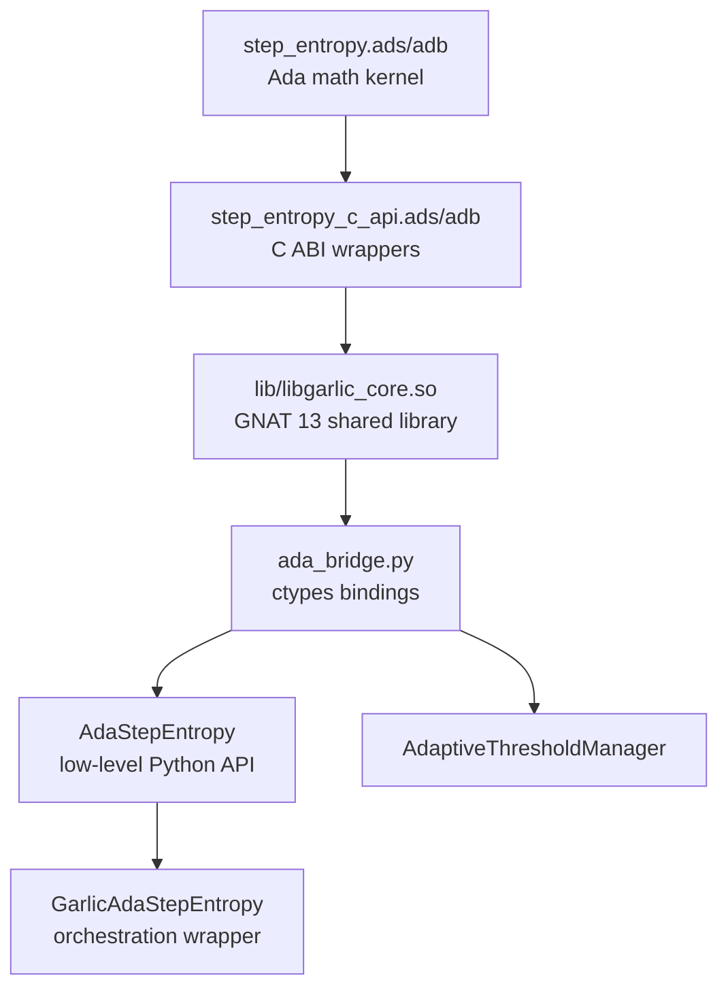
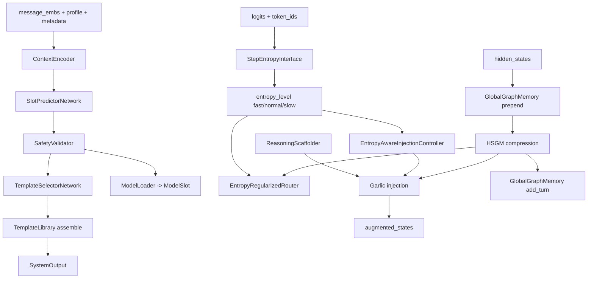

# SYSTEM_ROUTER_TOPOLOGY.md — ADA-Step-Entropy + System-Router CTM

> **Navigation anchor:** this map was extracted using `4-26-filetree-current-with-router.md` as the file-tree source of truth. Load that file before navigating paths.
> **Snapshot:** 2026-04-26 08:xx local | **Status:** ACTIVE CTM | **Mode:** repo-local topology, not implementation checklist

---

## 0. CORE VERDICT

`SYSTEM_ROUTER_CONSTITUTION.md` is the architecture constitution and staged target. The runtime code currently present in this repo is a **working composed integration**, not the giant fully-internalized single-file router described as a future/target shape in the constitution.

Current verified runtime truth:

- Root Ada bridge smoke test: `.venv/bin/python ada_bridge.py` → **16/16 PASS**.
- Router tests: `.venv/bin/python -m pytest System-Router/tests/test_system_router.py -q` → **32 passed**.
- Ada build: `gprbuild -P garlic_core.gpr` → **success**.
- Native library: `lib/libgarlic_core.so` links to `libgnat-13.so` and exports single-underscore C symbols.
- Current dirty tree before my edits: `M 4-26-filetree-current-with-router.md`, `?? 4-26-2026-garlic-router.zip`.

Do not let old doc statements about BUG-001/BUG-002 being blocking override this verified runtime state.

---

## 1. LOAD-BEARING CONCEPTS

### LBC-SR-1: Ada Step Entropy is the native difficulty primitive

**Definition:** The Ada library computes token entropy, routing classifications, compression analysis, pruning recommendations, histograms, z-score normalization, GRPO reward components, and adaptive threshold state through `Step_Entropy` + `Step_Entropy_C_API`.

**Why load-bearing:** System-Router treats entropy as the difficulty signal for routing, expert count, memory retrieval, and injection intensity. If the native entropy path is silently bypassed, the router may still run but the SOTA++ premise is weaker.

**Common misunderstanding:** “If SystemRouter tests pass, Ada is definitely active.” Not necessarily. `system_router.py` has a Python fallback path. Root `ada_bridge.py` smoke test is the stronger native proof.

**Verification:** Run `.venv/bin/python ada_bridge.py`, check `ADA_AVAILABLE` in `System-Router/system_router.py`, and inspect `nm -D lib/libgarlic_core.so` for single-underscore symbols such as `step_entropy_calculate_token_entropy`.

---

### LBC-SR-2: C API layer is the ABI boundary, not the core Ada package

**Definition:** `step_entropy_c_api.ads/adb` is the C-callable `System.Address` wrapper layer. `step_entropy.ads/adb` remains the mathematical Ada kernel.

**Why load-bearing:** Python ctypes cannot safely call Ada array/record-heavy routines directly. The C API narrows the boundary to primitive pointers/scalars and caller-owned output buffers.

**Common misunderstanding:** “Add Export pragmas directly to `Calculate_Token_Entropy`.” That was the earlier idea; the actual stable lane is the dedicated C API package with `External_Name` symbols.

**Verification:** `garlic_core.gpr` exposes both `Step_Entropy` and `Step_Entropy_C_API` in `Library_Interface`; `nm -D lib/libgarlic_core.so` shows both mangled Ada internals and C API exports.

---

### LBC-SR-3: Root Ada bridge and nested System-Router/ada_bridge are duplicated copies

**Definition:** There are two Ada bridge trees:

- Root: `ada_bridge.py`, `step_entropy*.ad[sb]`, `lib/libgarlic_core.so`.
- Nested: `System-Router/ada_bridge/ada_bridge.py`, `System-Router/ada_bridge/step_entropy*.ad[sb]`, `System-Router/ada_bridge/lib/libgarlic_core.so`.

**Why load-bearing:** A fix made only at root can drift from the nested System-Router copy. SystemRouter imports the nested package by inserting `System-Router/ada_bridge` into `sys.path`.

**Common misunderstanding:** “The root bridge passing proves the nested bridge is identical forever.” It proves this snapshot only if the files are actually synced.

**Verification:** Compare checksums or `diff -ru` root bridge files against `System-Router/ada_bridge/` before router-level release claims.

---

### LBC-SR-4: System-Router currently composes modules; it does not fully internalize them

**Definition:** `System-Router/system_router.py` imports components from `System-Router/Garlic-Components/` and neural primitives from `System-Router/neural_router.py`.

**Why load-bearing:** The constitution’s “everything in one file, 3500-4500 lines” is not current runtime truth. Current `system_router.py` is ~937 lines and uses import-composition.

**Common misunderstanding:** “The work remaining is to copy all Garlic components into `system_router.py`.” Maybe later, but current passing tests validate the import-composed design.

**Verification:** Read imports at the top of `System-Router/system_router.py`; run `wc -l System-Router/system_router.py System-Router/Garlic-Components/*.py`.

---

### LBC-SR-5: ModelSlot is not reasoning effort

**Definition:** `ModelSlot.SLOT_A/B/C` is a canon-agnostic dispatch mechanism. It intentionally replaced `ReasoningEffort` semantics.

**Why load-bearing:** Router decisions should select runtime-defined slots, not hardcoded “low/medium/high reasoning.” The system learns context-to-slot, while entropy supplies a second difficulty signal.

**Common misunderstanding:** Mapping `SLOT_A=low`, `SLOT_B=medium`, `SLOT_C=high` as fixed semantics. Those are only common runtime descriptions, not architecture law.

**Verification:** `System-Router/neural_router.py` defines `ModelSlot`, `ModelLoader`, `SlotPredictions.model_slot`, and tests assert `ReasoningEffort` is absent.

---

### LBC-SR-6: Hidden-state path controls most advanced stages

**Definition:** HSGM compression, semantic scaffolding, expert routing, Garlic injection, and GlobalGraphMemory update depend on `hidden_states` being present.

**Why load-bearing:** Template-only mode can pass tests without exercising the high-value graph/injection path. No hidden states means no HSGM memory update.

**Common misunderstanding:** “A prompt returned, therefore the 13-stage system ran.” Stage 12 can return a prompt while stages 2, 9, 10, 11, and 13 were skipped.

**Verification:** Use `return_trace=True`, pass real `hidden_states` and `logits`, and check trace keys for stage 2/8/9/10 plus `global_memory.turn_count`.

---

### LBC-SR-7: Fallbacks are operationally useful but epistemically dangerous

**Definition:** Root `ada_bridge.py` fails loud, but `System-Router/system_router.py` can fallback to Python entropy if nested Ada import fails, and `SystemRouterWrapper` can fallback to a static prompt on neural failure.

**Why load-bearing:** This keeps interactive work alive but creates false-success risk.

**Common misunderstanding:** “No crash means the full architecture is working.” In this repo, no crash may mean fallback.

**Verification:** Assert `ADA_AVAILABLE is True`, inspect `SystemOutput.trace`, and prefer native smoke tests for native-path claims.

---

## 2. INTERFACE MAP

### Ada kernel → C API → Python bridge

**Inputs:** float32 logits arrays, token IDs, entropy arrays, scalar thresholds, caller-owned output buffers.

**Outputs:** scalar entropy/probability, route ints, compression metrics, pruning indices, histogram buffers, GRPO buffers, threshold buffers.

**Contract:** Python validates shapes/ranges before crossing into C; Ada C API returns error sentinels instead of leaking Ada exceptions across the boundary.

---

### SystemRouter forward path

**Minimum working mode:** message embeddings/profile/metadata → template output.

**Full high-value mode:** add hidden states + logits + token IDs so HSGM, entropy, scaffolding, expert routing, injection, and memory update engage.

---

## 3. COMPLEXITY DISTRIBUTION

| Component | Density | Why |
|---|---:|---|
| `step_entropy.adb::Softmax` | DENSE | numerical stability, entropy bounds, uniform fallback |
| `step_entropy_c_api.adb` pointer reads/writes | DENSE | `System.Address` offset math can corrupt memory if wrong |
| `ada_bridge.py::_CBindings` | DENSE | ctypes signatures must exactly mirror C API spec |
| `GarlicAdaStepEntropy.compress_chain` | MEDIUM | [SKIP] insertion is orchestration-level, preserves step order |
| `System-Router/system_router.py::forward` | DENSE | many optional stages; fallback can hide skipped advanced path |
| `System-Router/neural_router.py::ModelSlot/ModelLoader` | MEDIUM | terminology and semantics are load-bearing |
| `System-Router/Garlic-Components/hsgm_*` | DENSE | shape contracts, graph construction, compression semantics |
| `System-Router/Garlic-Components/entropy_regularized_router.py` | DENSE | routing entropy vs step entropy are different scales |
| `System-Router/tests/test_system_router.py` | MEDIUM | strong regression suite but mostly small-dim and fallback-aware |
| `SYSTEM_ROUTER_CONSTITUTION.md` | MEDIUM | target architecture/spec, not always current implementation truth |

---

## 4. BAKED-IN DECISIONS

1. **Ada stays the math-critical kernel.** Do not migrate entropy math back into Python except as fallback.
2. **C ABI package stays thin.** Do not push routing policy or graph behavior into `step_entropy_c_api`.
3. **Mean-normalized step entropy is intentional.** Routing thresholds assume average entropy, not raw summed entropy.
4. **ModelSlot semantics remain runtime-defined.** Do not reintroduce hardcoded reasoning effort names into architecture.
5. **Root and nested bridge copies require sync discipline.** Future changes must state whether both copies were updated and verified.
6. **Fallbacks must be visible.** Any readiness claim must distinguish native path, Python entropy fallback, and static prompt fallback.
7. **`4-26-filetree-current-with-router.md` is the current navigation map.** If paths disagree with that map, inspect live filesystem before editing.

---

## 5. ANTI-CONCEPTS

| False attractor | Why it looks plausible | Why it is wrong here |
|---|---|---|
| “System-Router is already one giant internalized file.” | Constitution describes that target. | Current `system_router.py` imports `Garlic-Components` and `neural_router.py`; tests validate that composition. |
| “Reasoning effort is just renamed ModelSlot.” | SLOT_A/B/C often map to fast/general/deep in examples. | ModelSlot is canon-agnostic dispatch, not fixed effort semantics. |
| “Native path is proven by `pytest` alone.” | Tests pass and may run Ada path when available. | Root bridge smoke + explicit `ADA_AVAILABLE` are better proofs; fallback can pass. |
| “Root Ada bridge is the only bridge.” | Root files are the repo identity. | SystemRouter imports nested `System-Router/ada_bridge`. |
| “Step entropy threshold values can be reused for router entropy.” | Both are called entropy. | Step entropy bits and router gating entropy are separate scales (`2/4` vs `0.2/0.8`). |
| “No hidden states means full router validation.” | Prompt output succeeds. | HSGM, expert routing, Garlic injection, memory update may be skipped. |
| “Paper sum notation must replace mean.” | Eq. 2 uses sum notation. | Routing thresholds are operationally mean-normalized by design; this is documented as AD-003. |

---

## 6. FAILURE GRAMMAR FOR SYSTEM-ROUTER WORK

### SIG-SR-01: `ADA_AVAILABLE=False` but router tests pass

**Smell:** SystemRouter imports and tests succeed while Ada native bridge failed.

**Likely cause:** Python fallback is active. Useful for continuity, not acceptable for native-path release claims.

**Recovery:** Run root `.venv/bin/python ada_bridge.py`; then test nested import from `System-Router`; assert `system_router.ADA_AVAILABLE`.

---

### SIG-SR-02: Trace lacks advanced-stage keys

**Smell:** `SystemOutput.trace` has only template/model slot fields.

**Likely cause:** Missing `hidden_states`, `logits`, or relevant config enabled flags.

**Recovery:** Build a full input with hidden states + logits + token IDs; check `stage2_compression_ratio`, `stage8_entropy`, `stage9_signal`, `stage10_entropy_mean`.

---

### SIG-SR-03: Constitution and code disagree

**Smell:** Constitution says “move/copy/internalize” but runtime already has a passing composed integration.

**Likely cause:** Constitution is target plan + design record, while code is current implementation.

**Recovery:** Use live code/tests as runtime truth; update docs only after verifying current files.

---

### SIG-SR-04: Edits only root bridge or only nested bridge

**Smell:** Native smoke passes at root but SystemRouter behaves differently, or vice versa.

**Likely cause:** Bridge duplication drift.

**Recovery:** Compare root and nested bridge files; sync intentionally; rerun both root smoke and router tests.

---

### SIG-SR-05: High entropy does not trigger memory behavior

**Smell:** Entropy level is `slow` but no memory retrieval/injection effect is visible.

**Likely cause:** Step entropy path and HSGM/Garlic injection path are only loosely coupled in current implementation; `hidden_states`, `compressed_context`, and `semantic_signals` must all be present.

**Recovery:** Verify stage preconditions and trace. Do not assume `entropy_level='slow'` alone performs retrieval.

---

## 7. ENTRY VECTORS

| Task | Entry docs/files |
|---|---|
| Learn repo from scratch | `AGENTS.md` → `4-26-filetree-current-with-router.md` → `CONTEXT.md` → this file |
| Verify native Ada path | `FAILURE_GRAMMAR.md` → `step_entropy_c_api.ads` → `ada_bridge.py` → `.venv/bin/python ada_bridge.py` |
| Work on SystemRouter | `SYSTEM_ROUTER_CONSTITUTION.md` → this file → `System-Router/system_router.py` → `System-Router/tests/test_system_router.py` |
| Fix ModelSlot drift | this file LBC-SR-5 → `System-Router/neural_router.py` → tests asserting no `ReasoningEffort` |
| Investigate graph/memory routing | this file LBC-SR-6 → `System-Router/Garlic-Components/hsgm_*` → `entropy_regularized_router.py` → full hidden-state test |
| Sync root/nested Ada bridge | this file LBC-SR-3 → root files + `System-Router/ada_bridge/` files → smoke tests both contexts |
| Update docs | `AGENTS.md` → `CONTEXT.md` → `MEMORY.md` → this file → avoid stale BUG-001/BUG-002 claims |

---

## 8. CURRENT SAFE NEXT LANES

1. **Doc-lock lane:** finish reconciling old BUG-001/BUG-002 text across `AGENTS.md`, `CLAUDE.md`, `CONTEXT.md`, `MEMORY.md`, `TOPOLOGY.md`, and `FAILURE_GRAMMAR.md`.
2. **Nested bridge parity lane:** checksum/diff root bridge vs `System-Router/ada_bridge`, then record parity in `MEMORY.md`.
3. **Full-stage runtime lane:** add or run an integration test with real `hidden_states`, `logits`, and `token_ids` so stages 2/8/9/10/11/13 are exercised together.
4. **Constitution reduction lane:** split `SYSTEM_ROUTER_CONSTITUTION.md` target plan from current implementation status so agents stop treating target design as live runtime truth.
5. **Skill package lane:** create a Codex skill for `ada-step-entropy-system-router` only after this CTM stabilizes; the skill should load this file conditionally, not all docs upfront.
