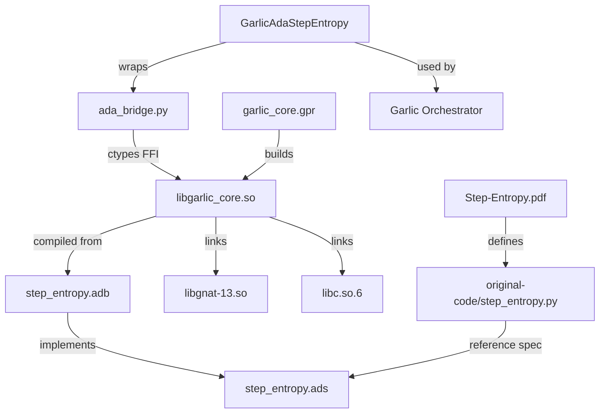

# TOPOLOGY.md — ADA-Step-Entropy Domain Map

> Load this when: entering the Ada implementation, debugging FFI, planning new features.
> This is the cognitive topology. Not a tutorial. Assumes full technical depth.

---

## LOAD-BEARING CONCEPTS

### LBC-1: Shannon Entropy as Routing Signal

**Definition**: `H(t) = -Σ_{w∈V} p(w|ctx) log_2 p(w|ctx)` — information-theoretic uncertainty of the model's next-token distribution.  
**Why load-bearing**: Everything downstream (routing, compression, pruning) depends on this being computed correctly. A 1% error here propagates to every decision.  
**What breaks if misunderstood**: Using logits directly instead of softmax probabilities. Using natural log instead of log_2. Not clamping for numerical stability.  
**Ada location**: `Calculate_Token_Entropy`, `Softmax` (private), `Safe_Log` (private)

### LBC-2: Step-Level Aggregation (Mean vs Sum)

**Definition**: `H(S_i) = (1/M_i) Σ_j H(t_{i,j})` — the Ada implementation uses MEAN normalization.  
**Why load-bearing**: The routing threshold comparison (`avg_entropy < threshold_low`) only makes sense with a normalized value. Sum entropy grows with step length, making thresholds length-dependent.  
**What breaks if misunderstood**: Reverting to sum-based routing would break threshold comparisons for variable-length steps. Thresholds would need to be length-scaled.  
**Paper note**: Paper Section 2.2 writes `H(S_i) = Σ H(t)` (sum notation) but the intent for routing is mean-normalized. This is documented as INTENTIONAL in MEMORY.md AD-003.

### LBC-3: Ada Type System as Specification

**Definition**: Ada's `Static_Predicate`, `Pre`, and `Post` contracts are executable mathematics.  
**Why load-bearing**: `type Entropy_Value is new Float with Static_Predicate => Entropy_Value >= 0.0` makes entropy non-negativity a TYPE CONSTRAINT, not a runtime check. Same for `Probability_Value ∈ [0,1]`.  
**What breaks if misunderstood**: Assuming these are just documentation. They ARE the spec. Violating them raises `Assertion_Error` in debug mode, and the compiler verifies static cases.  
**Critical**: When adding new types, always use `Static_Predicate` for mathematical invariants.

### LBC-4: FFI Symbol Name Convention Gap

**Definition**: Ada mangles symbols with double-underscore (`step_entropy__foo`). C/Python expects single-underscore (`step_entropy_foo`).  
**Why load-bearing**: THE BRIDGE IS CURRENTLY BROKEN because of this. `_AdaCFunctions.__init__` calls `ada_lib.step_entropy_calculate_token_entropy` which doesn't exist in the `.so`.  
**What breaks if misunderstood**: Thinking the current `.so` is usable. It is NOT until C-export pragmas are added.  
**Fix**: Add `with Export, Convention => C, External_Name => "step_entropy_X"` to each exported subprogram in the spec OR body.

### LBC-5: Calling Convention Boundary

**Definition**: Ada's calling convention ≠ C's for complex types. Arrays and records cannot be passed directly across the FFI boundary without careful marshaling.  
**Why load-bearing**: The bridge's ctypes definitions must exactly match what Ada expects. The `Token_Logits_Array` (array of arrays) cannot be passed as a ctypes double pointer without explicit Ada convention declarations.  
**Current bridge approach**: Scalar operations go through Ada FFI. Complex aggregation stays in Python. This is the right call (see MEMORY.md AD-002).

### LBC-6: Three-Path Routing Architecture

**Definition**: LOW → Fast (path 0, skip/compress), MEDIUM → Normal (path 1), HIGH → Slow (path 2, memory retrieval).  
**Why load-bearing**: This is THE routing signal that justifies the entire system. It connects to HSGM (Hierarchical Semantic Graph Memory) retrieval in the broader Garlic system.  
**What breaks if misunderstood**: Treating this as a simple classifier when it's actually a compute allocation decision with real latency implications.

---

## INTERFACE MAP

```
[LLM Generation Loop]
    │
    ↓ token logits (float[vocab_size])
    │
[Ada: Calculate_Token_Entropy]  ← single token, scalar output
    │
    ↓ H(t) entropy value (float >= 0)
    │
[Ada: Calculate_Step_Entropy]   ← N tokens, step record output
    │
    ↓ Step_Entropy record (total, avg, max, level, token array)
    │
[Ada: Route_Step]               ← step record → routing decision
    │
    ↓ Routing_Decision (Fast/Normal/Slow, retrieve_memory bool)
    │
[Python: GarlicAdaStepEntropy]  ← orchestration wrapper
    │
    ├─→ Fast: emit <SKIP> token
    ├─→ Normal: continue generation
    └─→ Slow: trigger HSGM retrieval
```

**What enters**: Raw logit tensors from LLM forward pass  
**What exits**: Routing decisions (fast/normal/slow) + compression recommendations  
**Handoff contracts**:

- Python → Ada: `float32` arrays via ctypes pointer, scalars via c_float/c_int
- Ada → Python: scalar floats/ints, integer routing codes

---

## COMPLEXITY DISTRIBUTION

| Component | Complexity Level | Why |
|-----------|-----------------|-----|
| `Softmax` (private) | 🔴 HIGH | Numerical stability is subtle — max-subtraction trick, epsilon floor, degenerate case |
| `Safe_Log` (private) | 🟡 MEDIUM | Epsilon clamping, base conversion |
| `Calculate_Token_Entropy` | 🟡 MEDIUM | Correct because it uses the above correctly |
| `Calculate_Step_Entropy` | 🟡 MEDIUM | Loop + bounds checking + string accumulation |
| `Sort_By_Entropy` (generic instantiation) | 🟢 LOW | Standard sort, just unusual Ada syntax |
| `Recommend_Pruning` | 🟡 MEDIUM | Index bookkeeping across sort |
| `Batch_Route` / `Batch_Route_Internal` | 🟢 LOW | Simple classification loop |
| `Token_Window` management | 🟢 LOW | Bounded buffer, clear semantics |
| Ada FFI C-export layer | 🔴 HIGH | Calling convention, pointer casting, type marshaling |
| Python bridge `_AdaCFunctions` | 🔴 HIGH | ctypes type declarations must match Ada exactly |

**Slowdown zones** (verify here before trusting):

1. `Softmax` degenerate case (`Sum_Exp <= Epsilon`) → uniform distribution fallback
2. `Calculate_Step_Entropy` string accumulation (fixed-width `Token_Text`) — truncates silently if > 64 chars
3. `Recommend_Pruning` bubble sort — O(n²), fine for small N (<512)

---

## DEPENDENCY GRAPH



---

## BAKED-IN DECISIONS (Invisible Load-Bearing Walls)

1. **Fixed array bounds**: `Max_Vocab_Size = 50257`, `Max_Tokens_Per_Step = 512`. Ada arrays are statically bounded. Dynamically-sized input that exceeds these will raise `Constraint_Error`. This is INTENTIONAL (fail loud).

2. **1-indexed Ada arrays**: All Ada arrays are 1-indexed. The bridge compensates with `Token_Index + 1` conversions. Any new C export wrapper MUST handle this offset.

3. **`Token_Text` is a fixed-width string of 64 chars**: Padding with spaces, not null-terminated. Python bridge must encode/decode accordingly. Tokens longer than 64 chars will be silently truncated.

4. **`Library_Interface` in GPR**: `for Library_Interface use ("Step_Entropy")` — this tells `gprbuild` that only `Step_Entropy` package is the public interface. Other packages in the project won't be exported. Any new public package needs to be added here.

5. **Assertions enabled** (`-gnata`): Ada assertions (Pre/Post/Predicates) are ACTIVE at runtime. This is correct for a SOTA research codebase. Do not disable for "performance" — the contracts ARE the spec.

---

## ANTI-CONCEPTS (False Attractors)

- ❌ **The existing `.so` is usable on this machine**: It needs `libgnat-12.so` which is absent. Ignore it until recompile.
- ❌ **The bridge works as-is**: The symbol names don't match. The bridge will fail at import.
- ❌ **Step entropy is entropy of the step's logits**: It's the SUM/MEAN of TOKEN-LEVEL entropies, not a single entropy calculation over step-level logits.
- ❌ **Just use Python for entropy calculation**: The Python path exists as fallback only. The Ada path is the production path with verified contracts.
- ❌ **The paper's sum notation means use sum**: Mean normalization is correct for routing (see AD-003). The paper's sum is for theoretical exposition.

---

## FFI BRIDGE DEEP TOPOLOGY

This is the most complex part of the system. A single wrong ctypes type annotation causes silent memory corruption.

### What the bridge needs to export (from Ada side)

```ada
-- In step_entropy.ads or step_entropy.adb, add:

function C_Calculate_Token_Entropy
   (Logits : access Float;
    Logits_Length : Integer;
    Base : Float) return Float
   with Export, Convention => C,
        External_Name => "step_entropy_calculate_token_entropy";

function C_Calculate_Token_Probability
   (Logits : access Float;
    Logits_Length : Integer;
    Token_Id : Integer) return Float
   with Export, Convention => C,
        External_Name => "step_entropy_calculate_token_probability";

function C_Classify_Entropy
   (Entropy : Float;
    Threshold_Low : Float;
    Threshold_High : Float) return Integer
   with Export, Convention => C,
        External_Name => "step_entropy_classify_entropy";
```

### What the bridge declares on the Python side (must match above)

```python
# Already correct in ada_bridge.py:
self.calculate_token_entropy.argtypes = [
    ctypes.POINTER(ctypes.c_float),  # logits array
    ctypes.c_int,                    # logits length
    ctypes.c_float,                  # base
]
self.calculate_token_entropy.restype = ctypes.c_float
```

**The mismatch**: Ada exports `step_entropy__calculate_token_entropy` but Python calls `step_entropy_calculate_token_entropy`. Solution: explicit `External_Name` in Ada export pragma.


---

## 2026-04-26 ADDENDUM — System-Router Integration Topology

Load `SYSTEM_ROUTER_TOPOLOGY.md` for the full router CTM. This addendum records the kernel-side consequences.

### Updated FFI Truth

The earlier FFI topology correctly identified the C-export gap, but the current snapshot has resolved it through `Step_Entropy_C_API`:

- `step_entropy_c_api.ads/adb` exports C-callable single-underscore symbols.
- `garlic_core.gpr` includes both `Step_Entropy` and `Step_Entropy_C_API` in `Library_Interface`.
- `lib/libgarlic_core.so` links to `libgnat-13.so` and exposes symbols expected by `ada_bridge.py`.
- `.venv/bin/python ada_bridge.py` passes 16/16 smoke tests.

### New Load-Bearing Boundary: Root vs Nested Bridge

There are now two bridge locations:

1. Root ADA-Step-Entropy bridge (`ada_bridge.py`, root Ada files, root `lib/`).
2. Nested System-Router bridge (`System-Router/ada_bridge/`).

The root bridge is the canonical kernel smoke-test lane. The nested bridge is the SystemRouter import lane. Future work must keep them synchronized intentionally.

### Router Coupling

`System-Router/system_router.py` consumes entropy through a `StepEntropyInterface` abstraction:

- Native path: `GarlicAdaStepEntropy` via nested `ada_bridge`.
- Fallback path: `PythonStepEntropyFallback`.

This fallback is useful but can create false success. Native-path readiness requires asserting `ADA_AVAILABLE=True` and running native smoke tests.

### New Anti-Concept

❌ **“SystemRouter passing means every advanced stage ran.”** Template-only tests can pass while HSGM, semantic signals, expert routing, Garlic injection, and GlobalGraphMemory update are skipped because `hidden_states`/`logits` were absent or config flags disabled.
