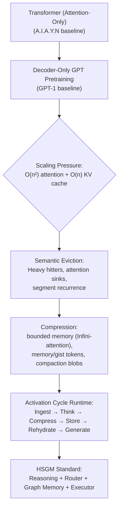
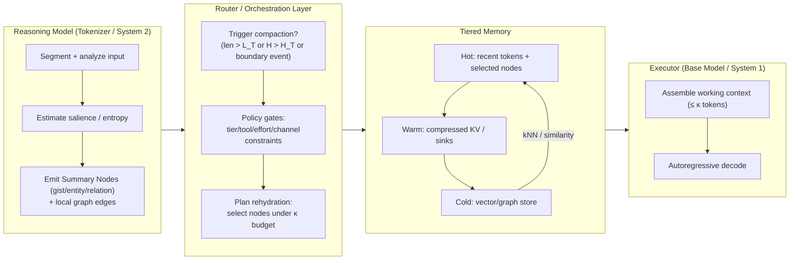

# Garlic: How the GPT Architecture Became the LLM  

## From Attention to Activation Cycles: A Graph-Memory Standard for Post-Transformer Systems

### Abstract
The original Transformer displaced recurrence and convolution by relying solely on scaled dot-product attention. Seven years later, frontier “GPT-class” systems exhibit behaviors that cannot be explained by attention alone: boundary-triggered compression, dual-buffer reasoning, graph-based retrieval, and policy-driven routing. We propose Hierarchical Segment-Graph Memory (HSGM) as a formal architecture for these post-Transformer systems. HSGM specifies a dual-model pipeline (Reasoning → Executor), a semantic graph memory with salience-weighted nodes, tiered storage with explicit transfer operators, and a router that orchestrates compression, rehydration, and safety policy. This whitepaper formalizes the components, presents algorithmic hooks for salience scoring, boundary compaction, and rehydration, and outlines empirical protocols to falsify or validate the activation-cycle hypothesis. We argue that HSGM provides a normative standard for “LLM-as-system” design, subsuming attention as a local primitive while elevating routing, memory, and policy to first-class architectural elements.

---

### 1. Reintroducing “Attention Is All You Need”
The 2017 Transformer paper is frequently summarized as a slogan, but the paper’s own claim is more exact: dominant sequence-transduction models were encoder–decoder stacks built from recurrence or convolution, “connect[ing] the encoder and decoder through an attention mechanism”; the authors then “propose a new simple network architecture, the Transformer, based solely on attention mechanisms, dispensing with recurrence and convolutions entirely” [1, p. 1]. This is simultaneously an architectural statement (self-attention + point-wise feed-forward blocks) and a computational statement: once recurrence is removed, the model’s dominant computations can be parallelized over positions.

The motivation is the serial dependency of recurrent computation. If hidden states must be produced step-by-step, “this inherently sequential nature precludes parallelization within training examples”, which becomes more constraining as sequences grow and batching becomes memory-bound [1, p. 2]. The Transformer’s replacement is a global interaction operator. The authors put the transition in the clearest possible terms: “In this work we propose the Transformer, a model architecture eschewing recurrence and instead relying entirely on an attention mechanism to draw global dependencies between input and output” [1, p. 2]. In effect, the dependency path between arbitrary tokens becomes a function of depth (layers), not time (steps), and the resulting computation is dominated by dense linear algebra.

In this whitepaper, we treat *scaled dot-product attention* as the baseline primitive:
\[
\mathrm{Attention}(Q,K,V) = \mathrm{softmax}\left(\frac{QK^\top}{\sqrt{d_k}}\right)V.
\]
The scaling factor \(1/\sqrt{d_k}\) stabilizes the softmax in high dimensions by preventing raw dot products from growing with \(d_k\). Multi-head attention instantiates multiple such operators in parallel over different learned subspaces and concatenates their outputs. The key qualitative justification appears explicitly: “Multi-head attention allows the model to jointly attend to information from different representation subspaces at different positions. With a single attention head, averaging inhibits this” [1, p. 5].

Because attention itself does not encode order, the Transformer injects positional information explicitly (sinusoidal or learned positional embeddings). In the original design, this is what makes “attention-only” compatible with language and translation: recurrence is not where order lives; order is a separate signal that can be added and then mixed by attention.

This baseline matters for HSGM because it specifies what is *inside* the core model: a differentiable operator that mixes token representations under a quadratic interaction pattern, plus feed-forward transforms. The remainder of this whitepaper concerns what modern systems appear to require *around* that operator: explicit memory tiers, boundary-triggered compression, stateful routing, rehydration, and policy enforcement.

#### 1.1 Contributions (this paper)
Against the attention-only baseline, this paper contributes: (1) a formal graph-memory model with node/edge types and salience measures; (2) tiered storage with explicit transfer operators (hot working set, warm compressed buffers, cold graph/vector stores); (3) a router contract that unifies compression triggers, policy gates (tier/tool/effort), and template/channel enforcement; (4) algorithms for boundary compaction, heavy-hitter retention, and budgeted rehydration; and (5) empirical protocols intended to falsify or validate the activation-cycle hypothesis.

#### 1.2 Decoder-Only Pretraining (GPT-1 Baseline)
If A.I.A.Y.N established attention-only modeling as an architectural primitive, GPT‑1 established decoder‑only generative pretraining as a general-purpose *training* primitive. The paper’s abstract states the two-stage recipe directly: “We demonstrate that large gains on these tasks can be realized by generative pre-training of a language model on a diverse corpus of unlabeled text, followed by discriminative fine-tuning on each specific task” [7, p. 1]. This shift is important: the “model” becomes less about bespoke task architectures and more about a reusable latent space produced by unsupervised objectives.

Formally, the pretraining stage maximizes the autoregressive likelihood of tokens:
\[
\max_\theta \sum_{t=1}^{T} \log p_\theta(x_t \mid x_{<t}),
\]
while the fine-tuning stage adapts the same decoder with task-specific supervision, but (crucially) without changing the core architecture. GPT‑1 emphasizes that transfer can be made effective “while requiring minimal changes to the model architecture” by using “task‑aware input transformations during fine‑tuning” [7, p. 1]. Prompt-formatting, in other words, is already a first-class interface between tasks and the shared decoder.

At the implementation level, GPT‑1 is a masked, decoder‑only Transformer stack. In the model specification, the authors report: “We trained a 12-layer decoder-only transformer with masked self-attention heads (768 dimensional states and 12 attention heads)” [7, p. 5]. Training proceeds over “contiguous sequences of 512 tokens” and uses a “bytepair encoding (BPE) vocabulary with 40,000 merges” [7, p. 5], reflecting the early emergence of a fixed context window as a computational constraint rather than a linguistic one. The unsupervised corpus choice is also aligned with discourse-scale learning: the BooksCorpus collection contains long contiguous spans, which the paper notes as important for learning long-range dependencies [7, p. 4].

This GPT baseline establishes the lineage that HSGM claims to extend. Attention remains the local mixing operator, but by the time GPT‑1 formalizes pretraining and “task‑aware” formatting, the system boundary has already begun to move outward: interface conventions (input transformations, prompts) and runtime constraints (fixed windows) become as consequential as layer counts. HSGM proposes that the contemporary evolution of this lineage is not simply “bigger GPT”, but a layered activation-cycle system that explicitly models memory, routing, and policy around the core decoder.

---

### 2. Transition: From Attention/GPT-1 to Today’s Activation-Cycle LLMs
If A.I.A.Y.N established attention as an architectural primitive and GPT-1 established decoder-only generative pretraining as an engine for transfer, the 2023–2026 period establishes something broader: **the LLM becomes a system**. The core argument of the compression-era research in this repository is not that attention stopped working, but that attention became too expensive to run “monolithically” at the advertised scales [8–10]. A runtime emerged around attention—compression, salience, routing, and rehydration—whose behavior is visible at the surface even when its internal representations are not [8–10].

#### 2.1 The Quadratic Wall and the KV Cache as Physics
Self-attention removes the sequential dependency that makes RNN training hard to parallelize, but it does not remove the fundamental dependence on sequence length. Compute grows at least quadratically with sequence length, and the KV cache required for autoregressive decoding grows linearly with the number of tokens retained. Compression-era analyses repeatedly emphasize the gap between the *advertised addressable space* (e.g., 1M–10M tokens) and the *mechanistic attention implementation* that can be afforded in real inference settings [8–10]. In the terminology used by the Gemini/Kimi-style reports, “infinite context” becomes a triumph of compression engineering rather than raw capacity scaling [8–10].

We can formalize the KV cache constraint with a simple scaling law. For a decoder-only Transformer with \(L\) layers, model width \(d\), and sequence length \(n\), the stored keys and values per layer are each \(n\times d\). If we store in FP16 (\(b=2\) bytes per scalar), KV memory scales as
\[
\mathrm{Mem}_{KV}(n) \approx 2\cdot L \cdot n \cdot d \cdot b,
\]
ignoring implementation overhead and additional caches. At million-token lengths, \(\mathrm{Mem}_{KV}\) falls in the hundreds of gigabytes to multi-terabytes depending on \(L\) and \(d\), which is incompatible with single-GPU deployment. Compression-era reports in `research/` repeatedly quantify this incompatibility and motivate bounded working sets on the order of \(10^5\)–\(2\times10^5\) tokens [8–10].

#### 2.2 From Structural Sparsity to Semantic Eviction
The first wave of long-context techniques attempted to reduce quadratic attention by imposing structure: fixed or patterned sparsity, local windows, and segment recurrence. Over time, the research trajectory moves from structural decisions (“where to look”) to semantic decisions (“what matters”). The heavy-hitter line of work (e.g., H2O) exploits a robust empirical fact: attention mass concentrates on a small subset of tokens. Eviction policies keep the heavy hitters and recent tokens, discarding low-salience tokens from the KV cache. The conceptual shift is subtle but important: the system now needs a *salience estimator* and an *eviction policy* in addition to attention itself [8].

This semantic turn generalizes into bounded-memory mechanisms such as Infini-attention and memory-token approaches. Instead of discarding old states, aging information is folded into a fixed-size memory structure (a compressed matrix, a set of summary tokens, or a latent state blob). Retrieval becomes a learned operation: queries attend not to all raw tokens, but to a compacted representation whose content has already been filtered by salience [8].

#### 2.3 Activation Cycles and Boundary-Centric Compression
In the Kimi-k2 compression report’s framing, “context window compression” ceases to be a single mechanism and becomes a paradigm: the system reduces a large effective context into a smaller “working set,” using a loss-aware process that triggers at specific boundaries (turn boundaries, tool boundaries, or thresholds) rather than continuously. This yields an *activation-cycle architecture*: Input → forward pass on a bounded working context → output → post-processing stage (compression/eviction/state update) → next activation. Crucially, the compression output is often opaque: latent “memory slots” or “context blobs” designed to preserve task state more effectively than human-readable summaries [9].

Two behavioral signatures follow directly. First, “gist preservation over verbatim recall”: semantic content is retained while surface form degrades. Second, boundary sensitivity: if compaction discards a user-salient detail, the model may exhibit sudden forgetting immediately after a compaction boundary. These signatures, emphasized in the research reports, provide falsifiable predictions for whether a system is operating via activation cycles rather than full attention over the entire history [8, 9].

#### 2.4 Compaction as an Interface, Not Just an Internal Trick
Compression becomes “real” when it becomes callable. The research reports highlight developer-facing compaction endpoints (e.g., a `/responses/compact`-style operation) that return opaque items intended for reinjection into subsequent requests [9]. In the Kimi-k2 report’s reconstruction, GPT‑5.2 productizes this as “response compaction”: a boundary-triggered “loss-aware compression pass” that returns “opaque, encrypted items” (a context blob) explicitly designed for reinjection into the next request [9]. This matters because it externalizes the activation cycle: the system explicitly chooses a boundary, compacts the past, and replaces raw history with a dense representation. Such interfaces strongly suggest that the system is preserving latent state rather than text, since the returned artifact is designed for the model to consume, not for humans to read [9].

#### 2.5 Retrieval, Rehydration, and the Emergent Semantic Graph
Once compaction produces a latent representation, the next problem is selectivity: which pieces of compressed state should be “rehydrated” into the bounded working set for the next turn? Compression-era research converges on similarity-based retrieval (vector search) combined with multi-resolution chunking. At scale, this induces a graph-like memory structure: nodes correspond to gist vectors, entities, and relations; edges correspond to temporal adjacency, semantic similarity, or attention-derived association. The system’s effective behavior is thus closer to “semantic graph memory” than to raw token replay [8–10].

#### 2.6 Why a Router Became Mandatory

The activation-cycle view implies that “routing” is not optional glue; it is the control plane. A router (or orchestration layer) monitors context growth, assigns salience, decides when to compact, chooses when to rehydrate, enforces tier and tool policy, and ensures output formatting constraints (channels, tool schemas, citations). In other words, the system’s long-context behavior is jointly determined by (i) attention as a local primitive, and (ii) a router-managed memory lifecycle. This is the point at which the term “GPT architecture” stops describing a model family and starts describing a system: a collection of interacting modules whose combined behavior implements long-horizon reasoning under resource constraints [8, 9].

#### 2.7 Archaeology Timeline (2014–2026)
The research reports in this repository treat long-context capability as an archaeological stack rather than a single invention. Early “external memory” designs (e.g., Memory Networks and neural Turing-style mechanisms) established explicit read/write interfaces and multi-hop retrieval as a way to *iteratively construct context*. The Transformer then solved the parallelization bottleneck but introduced the quadratic wall; sparse/structured attention and segment recurrence attempted to expand effective context without changing the primitive. Long-context benchmarking subsequently exposed retrieval pathologies (“lost in the middle”) and motivated treating context as a managed resource rather than a passive tape. By 2024–2026, the convergence of “System 2” reasoning and memory management yields a mature activation-cycle paradigm: large context is ingested, distilled into latent state, evicted from the working set, and selectively rehydrated under router control [8, 9].

```mermaid
flowchart LR
  A2014["2014: Memory Networks / external memory\\n(multi-hop retrieval)"] --> A2017["2017: Transformer\\n(attention-only, quadratic wall)"]
  A2017 --> A2018["2018: GPT-1\\n(decoder-only pretraining)"]
  A2018 --> A2019["2019–2020: Sparsity + Recurrence\\n(Sparse Transformer, Transformer-XL, Longformer)"]
  A2019 --> A2023["2023: Long-context pathologies\\n(\"lost in the middle\") + LLM-as-OS memory"]
  A2023 --> A2024["2024–2025: Reasoning tokens / System-2 loops\\n(distill then discard scratchpad)"]
  A2024 --> A2026["2026: Activation-cycle systems\\n(compaction endpoints, opaque blobs, router rehydration)"]
```



---

### 3. HSGM Hypothesis and Architectural Standard
We posit HSGM as a reference architecture for post-Transformer systems: a dual-model pipeline (Reasoning → Executor) operating over a semantic graph memory, orchestrated by a router that enforces policy and compaction. Attention remains the local computational primitive; HSGM specifies the runtime around it.

#### 3.1 Hypothesis Statement
HSGM claims that the “GPT architecture” is no longer adequately described as a Transformer variant; instead, it is an **activation-cycle system** in which attention is the local compute substrate, but *routing and memory lifecycle management* determine long-horizon behavior. The core mechanism is that **reasoning acts as compression**: a system performs a high-cost analysis pass over large context, distills that context into latent “Summary Nodes,” and then performs lower-cost generation over a bounded working set. This hypothesis is stated explicitly in the synthesis documents as “Reasoning tokens are the compression mechanism,” and it is supported by independent compression-era research emphasizing boundary-centric compaction and latent context blobs [2–6, 8–10].

#### 3.2 The Two-Model Split: Reasoning vs. Action
The synthesis documents define a functional split between a Reasoning model (“Tokenizer” / System 2) and an Executor (“Base model” / System 1) [4]. The split is not merely about “thinking harder”; it is about **which artifacts persist**. Reasoning generates intermediate structure (latent states, graph nodes, salience scores) that can be carried forward; the Executor consumes only the bounded working set.

| Component | Role | Input | Output | Persistence |
|---|---|---|---|---|
| Reasoning Model | Intent analysis, graph construction, distillation | Potentially very large raw context | Summary Nodes + graph edges + salience | Writes to warm/cold tiers |
| Router / Orchestrator | Control plane: triggers, policy, prompt compilation | Context length, entropy, policy, tool needs | Actions: pass/compact/rehydrate; template+tool policy | Persists policy state |
| Executor | User-visible generation | Recent tokens + selected nodes (≤ κ) | Natural language + tool calls | Does not store scratchpad |

This split explains two otherwise puzzling observations: first, “gist vs. verbatim” behavior (semantic continuity without surface-form recall), and second, sudden boundary resets when compaction discards a premise that the user considered salient [3–5, 8–10].

#### 3.3 Summary Nodes and the Local Semantic Graph
The “Summary Node” is the basic unit of persistent semantic state: a dense vector embedding or opaque latent item annotated with minimal metadata (segment id, salience, type). The Graph Salience synthesis argues that paraphrasing bias is a behavioral signature of this representation: the model reconstructs meaning from an embedding but cannot reproduce the original surface form [3]. In HSGM terms, Summary Nodes populate a Local Semantic Graph whose node types include entity nodes (key concepts), gist nodes (segment summaries), relation nodes (associations), and sink nodes (structural anchors such as system prompt constraints). Edges arise from temporal adjacency, semantic similarity, and attention-derived association. This graph interpretation matches both the “vector DB rehydration” pattern and the heavy-hitter eviction pattern described in the compression-era research [3, 8–10].

#### 3.4 Tiered Memory and Activation Cycles
The synthesis documents repeatedly emphasize that compression is **boundary-centric**: it occurs at turn boundaries, tool boundaries, or when internal thresholds are exceeded [2, 4, 5]. The activation cycle can be summarized as:
Ingest → Reason (scratchpad) → Compress (Summary Nodes) → Store (warm/cold) → Rehydrate (retrieve nodes) → Generate.

Two specific claims are worth quoting because they define the standard we are formalizing:
> “Reasoning tokens are the compression mechanism.” [5]

> “The system maintains a much smaller ‘effective working set’ … while the rest of the context is held in a compressed, latent state.” [2]

These claims motivate the formal operators introduced later (compression \(C\), tier transfers \(\tau\), and rehydration \(\Phi\)) and clarify why the LLM’s behavior can exceed its nominal token window.

#### 3.5 Router as Policy and Prompt Compiler
The reverse-engineering synthesis argues that modern systems dynamically scaffold system prompts and tool manifests at runtime, with an explicit channel model (analysis/commentary/final) and tier-aware capability switching [6]. In HSGM, the router is the component that makes this explicit: it selects templates, injects policy flags (tier, modality, tool availability), enforces constraints (e.g., tool gating and channel compliance), and manages failover. This aligns with the view of the router as orchestration layer rather than classifier: it is the “brain” coordinating memory management and the activation cycle [2, 6].

#### 3.6 Evidence Map
The HSGM hypothesis is intentionally falsifiable; each major claim is tied to a distinct evidence type:

| Claim | Evidence type | Sources |
|---|---|---|
| KV cache physics mandates compression | Quantitative scaling laws | [2, 8–10] |
| Reasoning produces persistent gist state | Boundary compaction + dual-buffer behavior | [2, 5, 8–10] |
| Summary Nodes are embeddings (not text) | Paraphrasing bias + “opaque blob” interfaces | [3, 5, 9–10] |
| Graph memory is hierarchical and multi-resolution | Chunking + HMT/SimCAS precedents | [3, 5, 8–10] |
| Router is an orchestration layer | Dynamic prompt scaffolding + policy routing | [2, 6] |
| Failure modes cluster at boundaries | Boundary needle / drift signatures | [2, 3, 5, 8–10] |

The remainder of this paper transitions from hypothesis to specification: we formalize the graph-memory objects, define the router contract, and propose minimal empirical protocols to validate the standard.



The following sections will formalize these components, provide mathematical operators for compression/rehydration, and propose evaluation protocols to falsify or validate the HSGM standard.

### 4. Formal Model

#### 4.1 Sequences, Segments, and Working Set
Let a token stream \(T = (t_1,\dots,t_n)\) be segmented into \(S = \{s_i\}_{i=1}^k\), each of length \(|s_i| \le m\). The working-set budget is \(\kappa\) tokens (empirically \(\kappa \approx 10^5\)–\(2\times10^5\)). Compression ratio is \(\rho = n / \kappa_{\text{eff}}\), where \(\kappa_{\text{eff}}\) counts rehydrated gist.

We treat segmentation as a function \(\mathrm{seg}_m\) mapping a token stream into contiguous blocks of size at most \(m\): \(S = \mathrm{seg}_m(T)\). In practice, “segments” need not be purely contiguous tokens; they may align to semantic boundaries (messages, documents, tool outputs). However, \(\mathrm{seg}_m\) is sufficient to define budgets and transfer operators. The key constraint is that the Executor does not operate on \(T\) directly when \(n \gg \kappa\). Instead, it operates on a bounded context \(X_t\) at activation step \(t\) satisfying \(|X_t| \le \kappa\). This bounded context is constructed from:
\[
X_t = \underbrace{T_{\text{recent}}}_{\text{high fidelity}} \;\oplus\; \underbrace{\Phi(q_t, \mathcal{M}_t)}_{\text{rehydrated nodes}} \;\oplus\; \underbrace{\Pi(P_t)}_{\text{policy + templates}},
\]
where \(q_t\) is the current query representation, \(\mathcal{M}_t\) is the memory state (graph + indices), and \(\Pi\) is a prompt compiler driven by policy \(P_t\) (channels, tools, safety).

This separation is the central move of HSGM: large histories are not “fit into” the context window by truncation; they are converted into a smaller semantic state whose rehydration is query- and policy-dependent.

#### 4.2 Local Semantic Graph
Define \(G = (V, E, \mu, \sigma)\) where:
- \(V = V_{\text{entity}} \cup V_{\text{relation}} \cup V_{\text{gist}} \cup V_{\text{sink}}\).
- \(E = E_{\text{semantic}} \cup E_{\text{attention}} \cup E_{\text{temporal}} \cup E_{\text{hier}}\).
- \(\mu(v)\) holds metadata (e.g., source segment, token count), and \(\sigma(v) \in [0,1]\) is salience.

Each node \(v\in V\) carries an (often opaque) representation \(z(v)\in\mathbb{R}^d\) (an embedding or latent state) that supports retrieval. We therefore distinguish *representational content* \(z(v)\) from *rendered text* \(\mathrm{text}(v)\): the Executor may reconstruct \(\mathrm{text}(v)\) approximately from \(z(v)\), but verbatim reconstruction is not guaranteed. This distinction is essential to understanding paraphrasing bias as a structural consequence rather than an incidental failure mode.

Edges can be interpreted as typed, weighted relations \(e=(u,v,\tau,w)\) where \(\tau\) is an edge type (semantic similarity, temporal adjacency, attention-derived association, hierarchical containment) and \(w\in[0,1]\) is a strength. This allows retrieval to incorporate both direct similarity and graph traversal (e.g., retrieve a high-salience node and then expand to its neighborhood).

Salience \(\sigma(v)\) is the system’s “importance” scalar and is the basis for eviction and retention. In the general case, \(\sigma\) may depend on (i) intrinsic properties (frequency, recency), (ii) attention mass accumulated across turns, and (iii) task relevance to the current query. A generic decomposition is:
\[
\sigma_t(v)=\mathrm{clip}_{[0,1]}\Big(\alpha\,\sigma_{\text{attn},t}(v) + \beta\,\sigma_{\text{recency},t}(v) + \gamma\,\sigma_{\text{query},t}(v) + \delta\,\sigma_{\text{structure}}(v)\Big).
\]

#### 4.3 Compression Operator
Compression \(C: (S,\theta_C) \rightarrow (V, E, \rho)\) produces gist and entity nodes with salience scores. Salience can combine attention mass, recency decay, entropy of the segment, and keyword priors. Heavy-hitter retention keeps the top-\(k\) salience nodes; others are evicted or downweighted.

Operationally, compression is not “summarization.” It is a mapping from a high-dimensional token sequence into a smaller persistent state that preserves task-relevant semantics under future queries. We model this as producing (i) node representations \(z(v)\), (ii) typed edges, and (iii) an explicit compression ratio target \(\rho^\*\). The compression objective can be expressed as a constrained optimization:
\[
\min_{G} \; \mathcal{L}_{\text{loss}}(T, G) \quad \text{s.t.}\quad \kappa_{\text{eff}}(G) \le \kappa,\;\; \rho(G)\ge \rho^\*,
\]
where \(\mathcal{L}_{\text{loss}}\) penalizes loss of task-critical information (and optionally preserves internal reasoning state), and \(\kappa_{\text{eff}}(G)\) estimates how costly it is to rehydrate and include \(G\) in the working set.

The “heavy-hitter” principle is naturally expressed within this operator: if attention mass concentrates on a small set of tokens, then \(C\) can preferentially preserve the representations that those tokens contribute to, while discarding low-salience tokens that do not affect downstream outputs.

#### 4.4 Storage Tiers and Transfers
- Hot \(H\): recent tokens + selected high-salience nodes (budget \(\kappa\)).
- Warm \(W\): compressed KV or attention sinks (fixed-size matrix).
- Cold \(C_{\text{old}}\): vector/graph store of all nodes.
Transfers: \(\tau_{H\rightarrow W}\), \(\tau_{W\rightarrow C}\), and \(\tau_{\text{rehydrate}}: (C_{\text{old}}, q) \rightarrow H\), where \(q\) is a query embedding from the current turn.

Tiering is a resource-management contract. Hot memory is what the Executor can attend to directly; warm memory is what can be consulted cheaply via bounded structures; cold memory is what must be retrieved via indexing. Each tier has a budget:
\[
|H_t| \le \kappa,\qquad |W_t| \le \kappa_W,\qquad |C_t| \text{ unbounded (external)}.
\]
The transfer operators implement lifecycle management:
- \(\tau_{H\rightarrow W}\): compress/evict low-salience parts of hot context into bounded warm structures (e.g., sinks, matrices).
- \(\tau_{W\rightarrow C}\): persist summary nodes and graph structure to cold storage (vector index + graph store).
- \(\tau_{\text{rehydrate}}\): retrieve a subset of cold nodes (and possibly their neighborhoods) into hot context conditioned on the query and policy.

The crucial invariant is that \(\tau_{\text{rehydrate}}\) must respect the working-set budget and preserve prompt invariants (channels/tools), otherwise rehydration can silently break system behavior.

#### 4.5 Router Function
Router \(R\) consumes length \(|T|\), entropy \(H(T)\), and policy \(P\), returning an action \(a \in \{\text{PASS}, \text{COMPRESS}, \text{REHYDRATE}\}\). Typical triggers: \(|T| > L_T\) or \(H(T) > H_T\). Policy hooks enforce tool tiering and reasoning effort bounds.

We model the router as stateful: \(a_t = R(s_t, x_t)\), where \(s_t\) includes the current tier budgets, recent compaction events, tool constraints, and accumulated salience statistics, and \(x_t\) includes the new user message, tool results, and metadata. The router is responsible for selecting not only an action but also parameters \(\theta\) passed to downstream operators:
\[
(a_t,\theta_t)=R(s_t,x_t),\qquad s_{t+1}=U(s_t,a_t,\theta_t),
\]
where \(U\) updates router state after the action. This explicit statefulness captures why “routing” is inseparable from memory: compaction and rehydration decisions have persistent effects.

#### 4.6 Executor
Executor \(E_x\) receives (hot context, selected nodes) and performs autoregressive decoding. Node selection \(\Phi(q, V)\) uses similarity \(\phi\) (e.g., dot product) under budget \(\kappa\); gist nodes are always included.

We formalize node selection as a budgeted maximization problem. Let \(\mathrm{cost}(v)\) estimate the token footprint of including node \(v\) after rehydration, and let \(\mathrm{rel}(q,v)\) estimate relevance (similarity, salience, or graph-based). Then:
\[
\Phi(q, V) = \arg\max_{U\subseteq V}\; \sum_{v\in U}\mathrm{rel}(q,v)\quad \text{s.t.}\quad \sum_{v\in U}\mathrm{cost}(v)\le \kappa_{\text{rehydrate}}.
\]
In practice, \(\Phi\) is implemented by heuristics (top-\(k\) by composite score, neighborhood expansion from high-salience nodes) rather than exact optimization. The key architectural point is that \(\Phi\) is a *retrieval policy* and therefore belongs to the router/memory layer, not to the Executor.

#### 4.7 Template and Channel Enforcement
Prompts must contain channel declarations (analysis, commentary, final), tool schemas, and citation rules. Router-level validation ensures required sections are present and policy constraints are met (e.g., no code tools for free tier).

We treat the system prompt as a compiled artifact: a template with variables (date, model identity, tools), plus a policy-defined grammar for how the model may respond. Channel enforcement is not cosmetic; it is a separation-of-concerns mechanism that enables tool orchestration and hidden scratchpads. In HSGM, prompt compilation \(\Pi(P_t)\) is part of the router: it must ensure that rehydration does not break the contract (e.g., injecting retrieved text that mimics system instructions or violates tool schemas). This motivates explicit validation passes and, in production systems, robust prompt injection defenses.

---

### 5. Algorithms

#### 5.1 Salience Scoring
- Attention-based: \( \sigma_a(v) = \sum_{h} \text{attn}_h(v) \).
- Recency decay: \( \sigma_r(v) = \exp(-\lambda \Delta t_v) \).
- Entropy gating: if segment entropy \(H(s_i) > H_T\), force gist creation.
- Composite: \( \sigma(v) = \alpha \sigma_a + \beta \sigma_r + \gamma \text{keyword}(v) \).

#### 5.2 Boundary Compaction
Trigger when \(|T| > L_T\), entropy \(> H_T\), or boundary events (turn, tool call). Run \(C\) on recent window; move low-salience tokens to warm/cold; keep heavy hitters in hot.

#### 5.3 Heavy-Hitter Retention and Eviction
Maintain a priority queue of top-\(k\) salience nodes. Evict nodes with salience below a moving threshold or beyond age/recency bounds.

#### 5.4 Rehydration Selection
Given query \(q\), select top-\(k\) gist nodes and the highest-salience entities until the budget is reached. Ensure at least one node per recent segment to reduce boundary loss. Inject selected nodes into the hot context for the Executor.

#### 5.5 Policy Enforcement
- Tier-based tool gating: disallow python for free tier; force browser if has_tool_calls is true.
- Reasoning-effort bounds: disallow “high” reasoning for histories shorter than a minimum length.
- Template completeness: fail or fallback if required channel/tool/citation markers are missing.

---

### 6. Empirical Protocols
- **Boundary Needle Test:** plant facts near compaction boundaries; probe verbatim vs paraphrase recall.
- **Paraphrase Drift:** track fidelity over long dialogues; expect gist preservation but surface-form degradation.
- **Latency vs Context:** measure TTFT as context grows; activation-cycle systems should scale with working-set size, not total tokens.
- **Tool/Tier Compliance:** verify router enforces tiered tool access and reasoning effort bounds.
- **Channel Compliance:** ensure analysis/commentary/final structure is preserved under routing and fallback.

---

### 7. Related Work
Attention-only Transformers [1] introduced multi-head attention and positional encodings while discarding recurrence. Subsequent work added sparsity, recurrence over segments, compressive memory, and heavy-hitter eviction. HSGM unifies these strands into a router-centric standard that elevates semantic graphs and storage tiers to first-class architectural elements, treating attention as a local primitive within a larger activation-cycle system.

---

### 8. Conclusion
HSGM reframes “GPT” as a layered system: Reasoning for semantic compression, a Router for orchestration and policy, and an Executor for generation over a bounded working set. Attention remains essential but insufficient to explain modern behaviors. By formalizing graphs, salience, storage tiers, and routing contracts, HSGM offers a normative standard for post-Transformer systems and a blueprint for reproducible, testable, and policy-aware LLM deployments.

---

### References (selection)
[1] Vaswani et al., “Attention Is All You Need,” NIPS 2017.  
[7] Radford et al., “Improving Language Understanding by Generative Pre-Training,” 2018.  
[2] Structural Fossils: Evidence of Hidden Compression Mechanisms (internal).  
[3] Graph Salience: Evidence of Vector-Based Semantic Memory (internal).  
[4] The Daeron Hypothesis: Hierarchical Segment-Graph Memory (internal).  
[5] Evolution of Compression: From Memory Networks to Reasoning Tokens (internal).  
[6] Reverse Engineering ChatGPT System Prompt & Router (internal).
[8] Context Compression in Modern LLMs (Gemini) — internal research report (2026).  
[9] Kimi-k2 Report — internal research report (2026).  
[10] Qwen Research — internal research notes (2026).  
